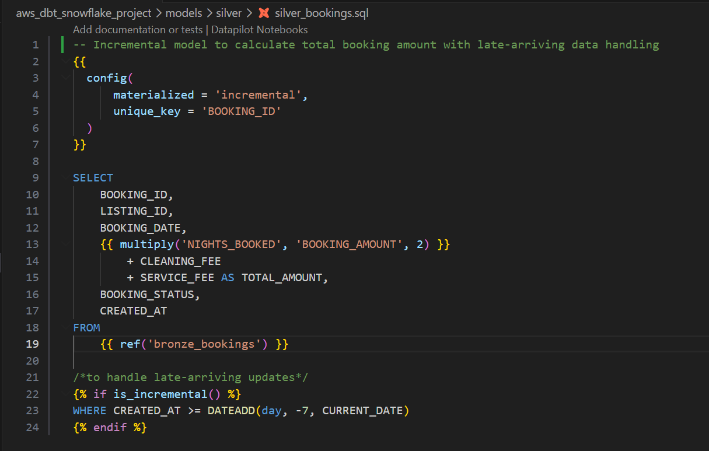

# 🏡 Airbnb Data Pipeline (Snowflake + dbt + Airflow)

## 📌 Overview

This project demonstrates an end-to-end **dbt-driven ELT pipeline** built on Snowflake using **medallion architecture (Bronze, Silver, Gold)**.

The pipeline ingests Airbnb dataset into Snowflake staging tables and transforms it into analytics-ready datasets using dbt models, reusable macros, and orchestrated workflows.

---

## 🏗️ Architecture


---

## ⚙️ Tech Stack

- **Cloud Platform:** AWS (S3 - data storage layer)  
- **Data Warehouse:** Snowflake  
- **Transformation:** dbt (Data Build Tool)  
- **Orchestration:** Apache Airflow  
- **Language:** SQL  
- **Version Control:** Git & GitHub 

---

## 🔄 Data Pipeline Flow

```
CSV Files
   ↓
Snowflake (Staging Layer)
   ↓
dbt Bronze (Incremental Models)
   ↓
dbt Silver (Data Cleaning & Transformation)
   ↓
dbt Gold (OBT + Fact Tables)
   ↓
Airflow (Orchestration Layer)
   ↓
Analytics / BI
```

---

## 🧱 Data Modeling (Medallion Architecture)

### 🟫 Bronze Layer (Incremental Ingestion)

* Built using **dbt incremental models**
* Loads only new data from staging tables
* Models:

  * `bronze_listings`
  * `bronze_hosts`
  * `bronze_bookings`

---

### 🟨 Silver Layer (Transformation Layer)

* Data cleaning and standardization
* Implemented reusable **dbt macros**:

  * `multiply` → calculates total booking value
  * `tag` → categorizes price into Low/Medium/High
  * `trimmer` → trims and standardizes text fields
* Additional transformations using CASE logic

---

### 🟥 Gold Layer (Business Layer)

* Built analytics-ready datasets
* Created:

  * **OBT (One Big Table)** by joining all entities
  * **Fact table** for numerical metrics

---

## 🔧 dbt Features Implemented

* Incremental Models for efficient data processing
* Modular transformations using `ref()`
* Reusable macros for business logic
* Layered architecture (Bronze → Silver → Gold)

---

## ⚙️ Orchestration (Airflow)

* Designed an Airflow DAG to automate pipeline execution
* Features:

  * Task dependency management
  * Parallel execution of models within Bronze and Silver layers
  * Sequential execution of Gold layer (OBT → Fact)
  * Data quality checks using `dbt test`
  * Failure alert mechanism

---

## 📂 Project Structure

```
aws_dbt_snowflake_project/
│
├── models/
│   ├── bronze/
│   ├── silver/
│   ├── gold/
│
├── macros/
│
├── airflow/
│   └── dags/
│       └── airbnb_pipeline.py
│
├── architecture.png
├── README.md
```

---

## 🧪 Data Quality

* Implemented dbt tests such as:

  * `not_null`
  * `unique`
* Ensures reliability and consistency of transformed data

---

## 🚀 Key Highlights

* Built a **dbt-driven ELT pipeline** with modular design
* Implemented **incremental data processing** for performance optimization
* Designed **scalable medallion architecture**
* Integrated **Airflow for orchestration and monitoring**
* Created **business-ready datasets for analytics**

---

## 💬 Project Summary

This project showcases the design and implementation of a modern data engineering pipeline using Snowflake, dbt, and Airflow. It highlights best practices in data modeling, transformation, and orchestration, making it production-ready and scalable.

---

## 🔗 Author

**Suchita Buva**
🔗 GitHub: https://github.com/suchita-buva

---

### Sample Transformation (SQL Model)


---

## 🔗 GitHub Repository

https://github.com/suchita-buva/aws-dbt-snowflake-project
